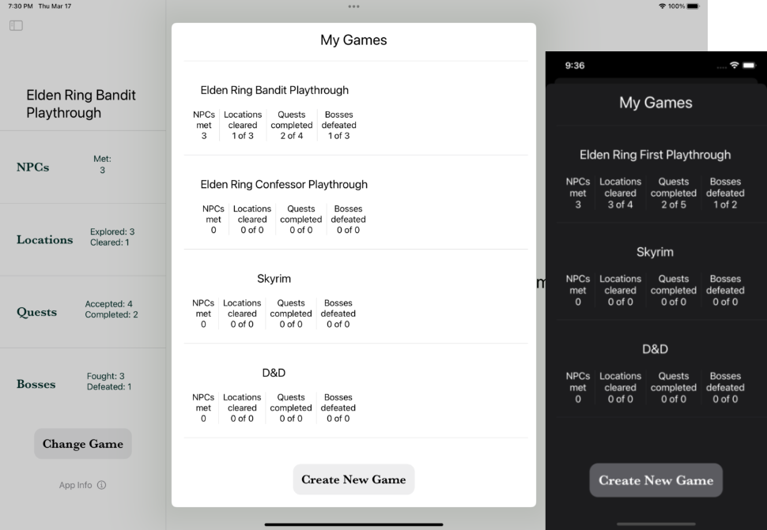

Elden Ring, like any good RPG game, invites multiple playthroughs. 

Shattered Ring lets you track as many game playthroughs as you'd like.
Whether you want to keep track of which NPCs you meet and quests you 
complete in each playthrough, or want to track something else entirely, 
like your regular D&D game, you can add new games to track them.

The Games view gives you a nice roundup of stats from each playthrough.
Completionists can appreciate clearing all of the locations or completing
all of the quests in a game. And who wouldn't enjoy claiming bragging 
rights over your friends about meeting more NPCs or clearing more locations?
