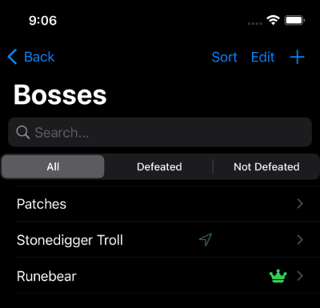

Track bosses in Elden Ring, another RPG game, or your regular D&D game. You 
can add notes for a boss, see the boss's location, and filter by 
defeated or undefeated bosses.

## View Bosses at-a-glance in the Boss list

From the Boss list, you can easily browse bosses and see at-a-glance which ones
you have defeated. You can view all bosses by default, or filter the list to see 
only defeated or undefeated bosses. A green crown icon at the right of a boss row 
indicates the boss is defeated. A green arrow in the boss row means the boss is at
a specific location.

The search field lets you find Bosses by name, _and_ it also searches the text of the 
notes you've added for each boss. Read online about a legendary piece of loot a boss
drops but aren't tough enough to beat it yet? Jot down the drop in the boss's notes
and you can find which boss dropped it later by searching for it.

## Track important Boss details

The Boss view is where you can store details about the bosses you're tracking. 

The top part of the boss view contains a clickable toggle to keep track of whether you've defeated the boss.

Below that, you'll see a a tabbed view where you can drill deeper into boss details:

- Notes
- Location
- Images
- Links

### Notes

When you go into the boss view, the first thing you see is notes associated with your boss. You can add or 
edit notes from here. You might use this to make note of the items that a boss drops, or strategies for fighting the boss. 
The note area is a scrollable field, so there's no end to how much text you can have in the notes for each boss. Remember
that the boss list lets you Search by boss notes, not just name, so if you want to know which boss drops that item you've 
been looking for, add it to the notes field!

### Location

You can add a location to a boss. When you add a boss's location, you can choose from an existing [Location](/app/track-locations/), or create a new one. Bosses only have one location.

### Images

You can save images to the boss view. Get an epic screenshot during your boss fight and commemorate it. Or if the boss
tends to roam an area, as in the case of a field boss, you can take a screenshot of the map where you expect to find the boss.

### Links

Save links to your favorite websites related to the boss. Do you have a favorite game guide for how to defeat the boss? Save it here. 
Want to keep track of what the boss drops? Save the wiki entry. When you click the link, it opens the page in a browser on your iOS device.

## Easily enter new Bosses

Because Shattered Ring is a spoiler-free tracking app that does not come with pre-loaded data,
I've made it as easy as possible to add details while you play.

From the Boss list, click the plus icon in the upper-right corner of the screen to create a new boss. 

In the new boss form, you can add a name, flip a toggle if the boss is defeated, and hit the `Create Boss` button. You can also add notes when you create the boss, or you can go back later and add them when viewing boss details.

After you create the boss, you can go to the boss's detail view to add a location, images, or links.

If you create the boss from the location view, the boss is automatically populated with the location whose view you created the boss from.