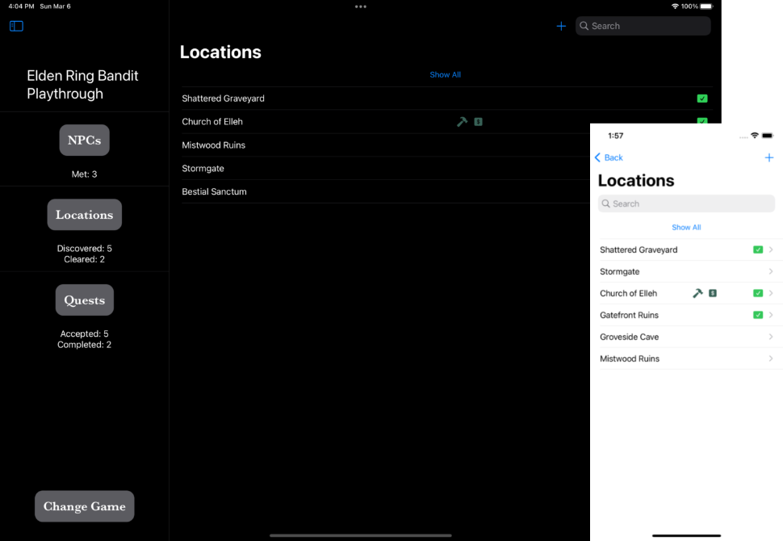
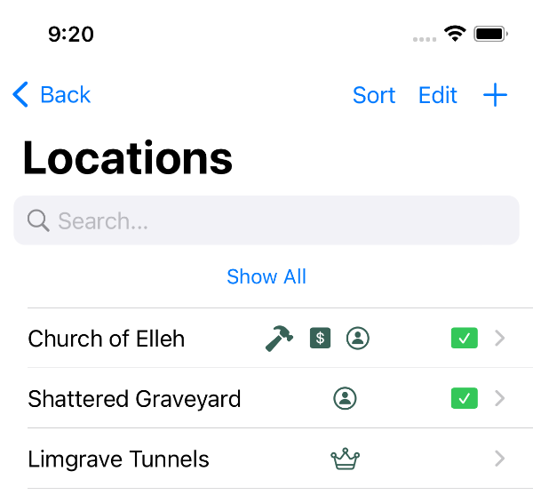
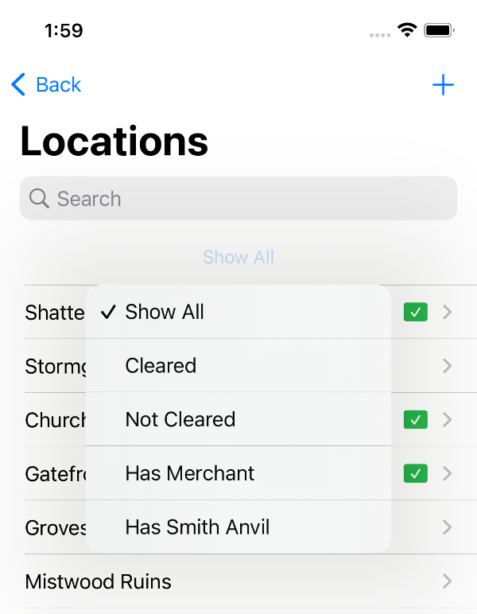
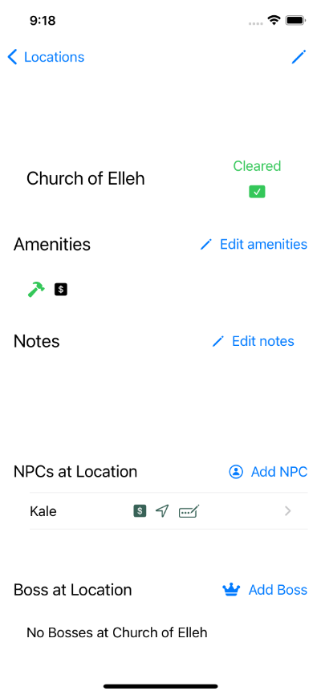
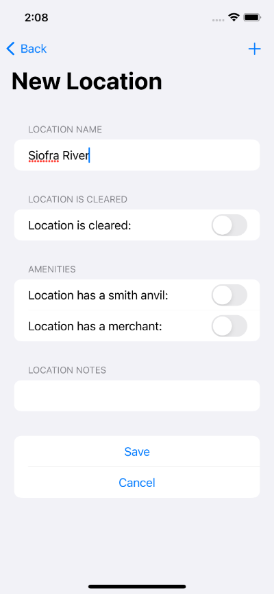

Track important locations, including details like:

- Whether the location has been cleared
- Amenities the location has, such as a merchant, blacksmith, or smith anvil
- Notes
- NPCs at the location
- A Boss at the location

## View Locations at-a-glance in the Locations list

From the Location list, you can easily browse important details about your locations. The 
icons next to `Church of Elleh` in this screenshot give you a quick snapshot:

- The hammer icon means there is a smith anvil at this location
- The dollar sign icon means there is a merchant at this location
- The green checkmark means the location has been cleared

You can view all locations by default, or filter the list.

Filter options include:

- Locations that are cleared
- Locations that are not cleared
- Locations that have a merchant
- Locations that have a smith anvil

The search field lets you find Locations by name, _and_ it also searches the text of the 
notes you've added for each location. Can't remember a location's name but you know it had 
a terrifying troll with a sword sticking out of its chest? If you jot down that note, 
you'll be able to find your location again!

## Track important Location details

The Location view provides details about your important locations. 

The top part of the location view contains a clickable toggle to keep track of whether you've cleared a location. You can also view and edit amenities that are at the location.

Below that, you'll see location notes, if you've added any. You can edit notes from here. The note area is a scrollable field, so there's no end to how much text you can have in the notes for each location.

You can view NPCs that are at the location, or add new NPCs when NPCs move around. You can click
into an NPC at a location to view all of their details, such as notes or quests the NPC has given you. For more details, see: [NPCs](/app/track-npcs/).

You can view a boss at the location, or add a new boss from the location view. You can click into a boss at a location to view notes you've saved about the boss, or to mark it defeated. For more details, see: [Bosses](/app/track-bosses/).

## Easily enter new Locations

iOS apps where you have to enter a lot of data are no fun to use, so Shattered Ring has been designed
to make it as easy as possible to add new locations. 

From the Location list, click the plus icon in the upper-right corner of the screen to create a new location. 

In the new location form, you can add as little as a name, flip a couple of toggles if the location is cleared, has a smith anvil, or has a merchant, and hit the `Create Location` button. You can also add notes when you create the location, or you can go back later and add them when viewing location details.

After you create the location, you can go to the location's detail view to add NPCs amnd bosses.

If you create the location from the NPC or boss view, the location is automatically populated with the NPC or boss whose view you created the location from.
