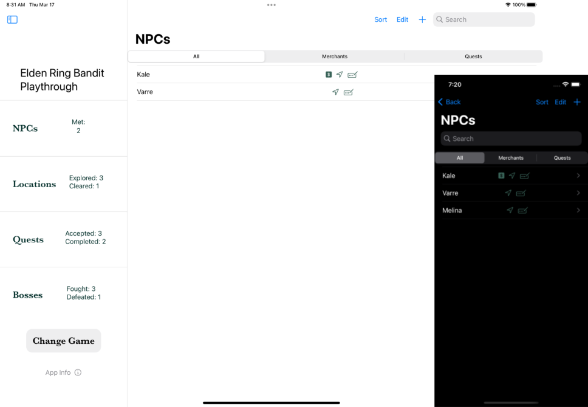
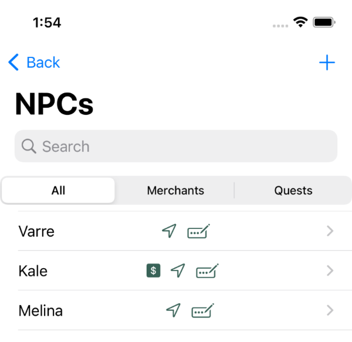
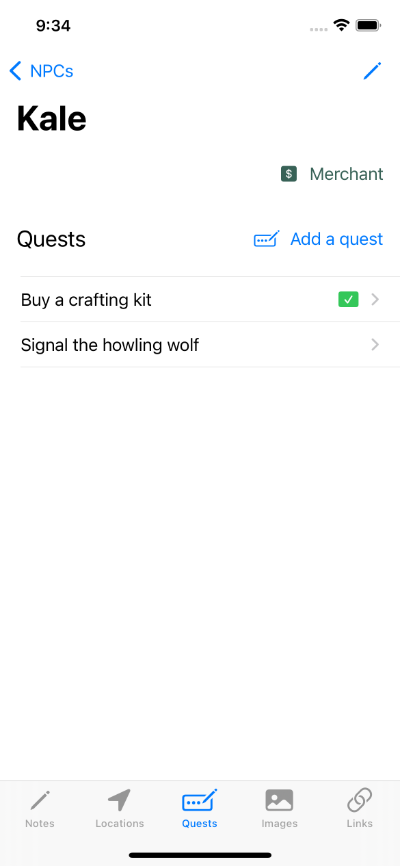
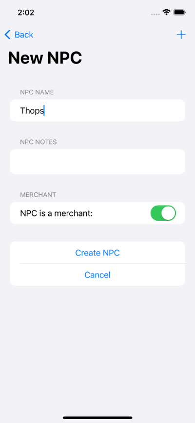
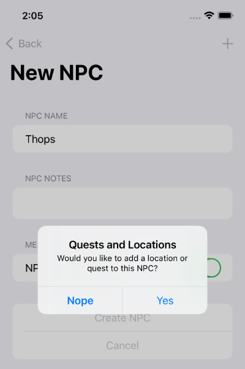
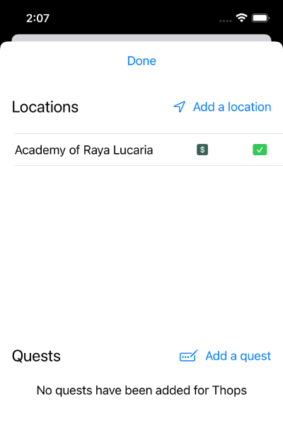

Find out how you can use the Shattered Ring iOS App to track NPCs in your favorite
RPGs.

Track important NPCs, including details like:

- Their locations 
- The quests they give you
- Notes
- Special details, like whether an NPC is a merchant

## View NPCs at-a-glance in the NPC List

From the NPC list, you can easily browse important details about your NPCs. The icons next
to NPC Kale's name in this screenshot give you a quick snapshot:

- The dollar sign means the NPC is a merchant
- The location arrow means the NPC is associated with one or more locations
- The ellipses with the pencil icon mean that the NPC has given you one or more quests

You can view all NPCs by default, or filter the list for NPCs that are merchants or NPCs 
that have given you a quest.

The search field lets you find NPCs by name, _and_ it also searches the text of the 
notes you've added for each NPC. Can't remember an NPC's name but you know they're a creepy half-orc?
If you jot down that note, you'll be able to find your NPC again!

## Track important NPC details

The NPC view provides details about your important NPCs. This is where you go to view NPC notes,
if you've added any. You can edit notes from here, and the note area is a scrollable field, so there's
no end to how much text you can have in the notes for each NPC.

You can view the location of an NPC, or add new locations to the NPC if the NPC moves around. 
The location list shows you amenities that are at the location, and whether or not you've
cleared a location. For more details, see: [Locations](/app/track-locations/).

You can also view the quests that the NPC has given you, or add new quests as the game progresses.
The quest list shows a green checkbox for quests you have completed. For more details, see: 
[Quests](/app/track-quests/).

## Easily enter new NPCs

iOS apps where you have to enter a lot of data are no fun to use, so Shattered Ring has been designed
to make it as easy as possible to add new NPCs. 

From the NPC list, click the plus icon in the upper-right corner of the screen to create a new NPC. 
In the new NPC form, you can add as little as a name, flip a toggle if the NPC is a merchant, and 
hit the `Create NPC`. You can also add notes when you create the NPC, or you can go
back later and add them when viewing NPC details.

After you create the NPC, you'll get a pop-up asking if you want to add any quests or locations
to the NPC.

If you just want to record the NPC, you can press `Nope` to stop here and go back to the
NPC list. 

If you do want to add a quest or location for the NPC, you'll go to the NPC
detail view in a little pop-up sheet where you can find or create locations and quests to 
add to the NPC.

After you're finished adding quests or locations to your new NPC, click `Done` at the top of the
sheet and you'll go back to the NPC list view.

If you've already entered a location or quest that you want to add to an NPC, don't worry!
When you create a new NPC, you can choose existing locations or quests as well as create new ones.
And you can always go to the NPC view to add a location or quest to the NPC, whether you want to
add one that you created separately, or you want to create a new one for this NPC.
