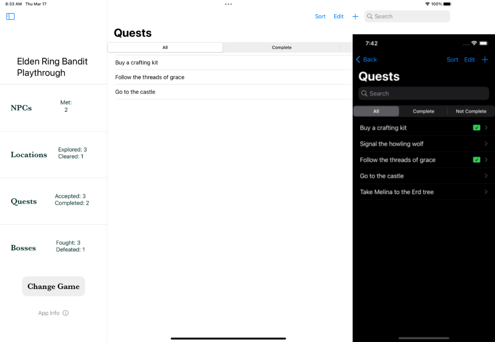
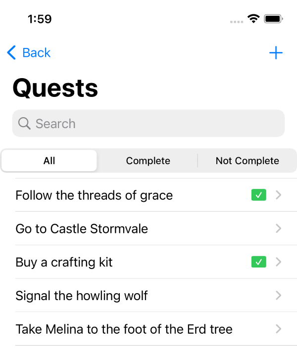
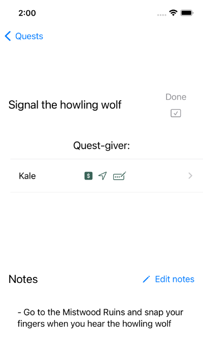
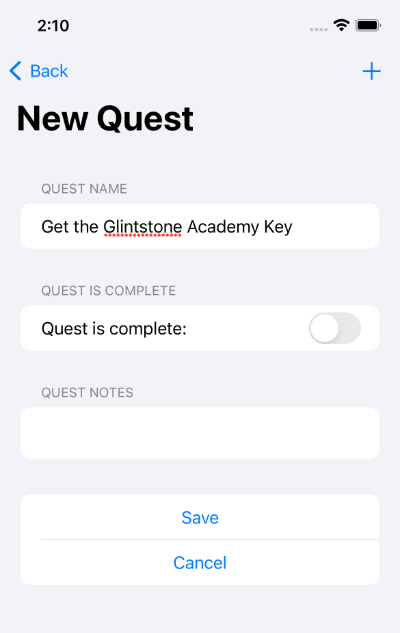

Track important quests in Elden Ring, another RPG game, or your regular D&D game. You 
can add notes for a quest, see the NPC who gave the quest to you, and filter by 
complete or incomplete quests.

## View Quests at-a-glance in the Quest list

From the Quest list, you can easily browse quests and their completion status. 
You can view all quests by default, or filter the list to see only complete 
or incomplete quests. A green checkbox at the right of a quest row indicates
the quest is complete.

The search field lets you find Quests by name, _and_ it also searches the text of the 
notes you've added for each quest. Can't remember what you called a quest but you 
know it involved a howling wolf? If you jot down that note, you'll be able to find your 
quest again!

## Track important Quest details

The Quest view provides details about your important quests. 

The top part of the quest view contains a clickable toggle to keep track of whether you've completed the quest.

Below that, you'll see a quest giver, if you've added one. When you add a quest-giver, you can 
choose from an existing [NPC](/app/track-npcs/), or create a new one. Quests only have one quest giver.

And finally, you'll see notes associated with your quest. You can add or edit notes from here. 
The note area is a scrollable field, so there's no end to how much text you can have in the notes 
for each quest.

## Easily enter new Quests

iOS apps where you have to enter a lot of data are no fun to use, so Shattered Ring has been designed
to make it as easy as possible to add new quests. 

From the Quest list, click the plus icon in the upper-right corner of the screen to create a new quest. 

In the new quest form, you can add a name, flip a toggle if the quest is complete, and hit the `Save` button. You can also add notes when you create the quest, or you can go back later and add them when viewing quest details.

After you create the quest, you can go to the quest's detail view to add NPCs.

If you create the quest from the NPC view, the quest-giver is automatically populated with the NPC whose view you created the quest from.